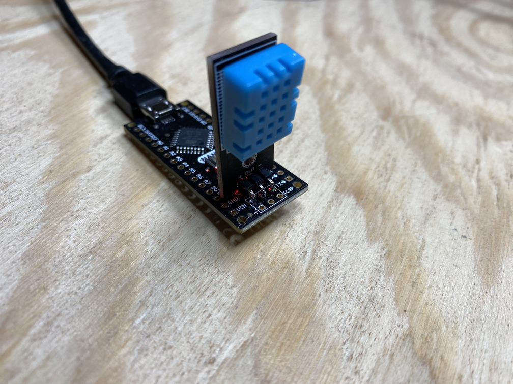
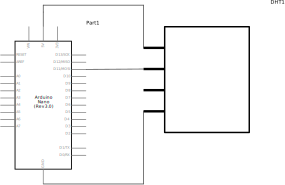
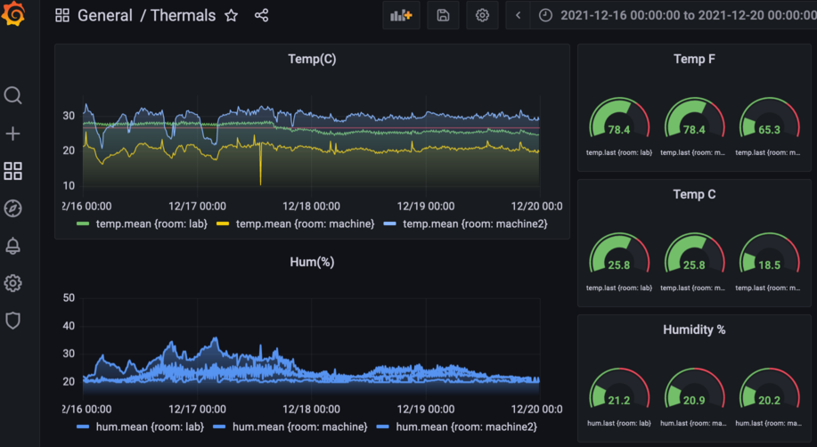
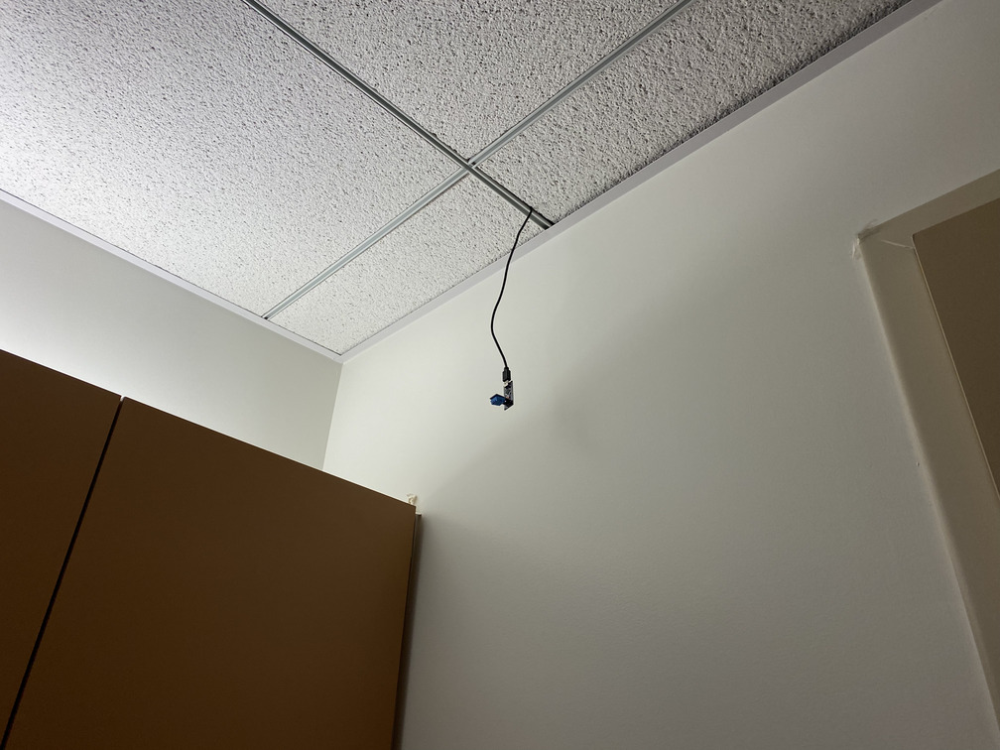
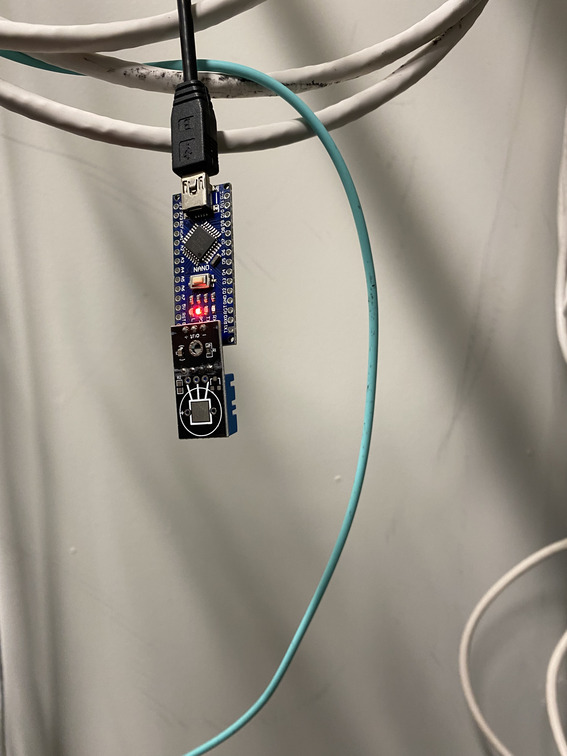

# DHT11ToSerial

Small system to read temperature and humidity using a DHT11 sensor over USB and transmitting to an influxdb instance.

## Physical assembly

Parts:
* Atmega328p "Arduino Nano"
* DHT11 module

The DHT11 sensors I bought have the signal pin in the middle, so I just solder it into the gnd/mosi/vcc side of the ICSP header and use pin 11.

## Firmware
Compile and upload with platform.io.

## Polling utility
post.py is a simple utility to read the next line from the serial port, parse the JSON and send the data to the influxdb server. Set appropriate values in config.py and cron it.

## Grafana output

Graph temp:
> `SELECT mean("value") FROM "temp" WHERE $timeFilter GROUP BY time($__interval), "room" fill(null)`

Get latest temperature:
> `SELECT last("value") FROM "temp" GROUP BY "room"`

Latest temperature as F:
> `SELECT last("value")*9.0/5.0+32.0 FROM "temp" GROUP BY "room"`

Pics:

